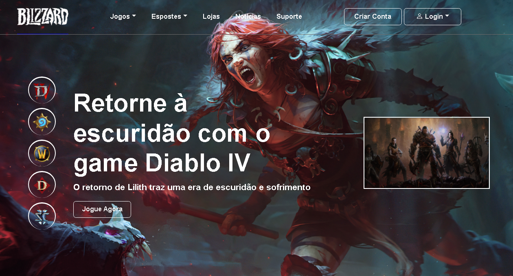

# Games-Blizzard

  

---

## 😅 Descrição 😍

Inspirado pela página de jogos da Blizzard, considero este o meu projeto mais esteticamente atraente, Este projeto foi inspirado por um aluno da Tryp, infelizmente não recordo o nome dele, porém sou grato por ele ter me permitido criar este projeto com base na inspiração dele. Adicionei algumas nuances do meu próprio estilo, buscando dar um toque pessoal ao trabalho. O famoso ditado "copia mais não faz igual" se aplica aqui, pois, embora tenha iniciado com uma base semelhante, busquei interpretar e inovar por conta própria.

---

## 🚀 Tecnologias

Este projeto foi construído utilizando as seguintes tecnologias:

- HTML
- CSS
- JavaScript
- Bootstrap
- Sass

---

## ✨ Informações

O projeto apresenta as seguintes características:

- Layout responsivo para diferentes dispositivos
- Utilização de HTML5 Semântico para melhorar a otimização nos mecanismos de busca

---

## 🛠 IDE Utilizada

- Visual Studio Code

---

## 🔎 Deploy

Confira o site hospedado através do link abaixo:

### [Games Blizzard - Hospedagem](https://ramon-rodrigues-001.github.io/Games-Blizzard/)

